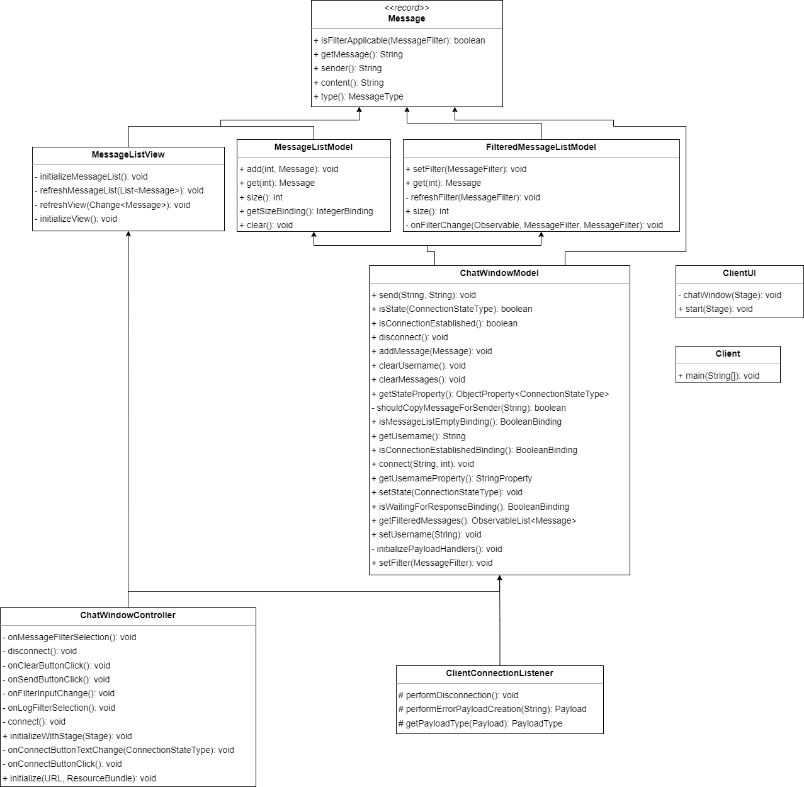
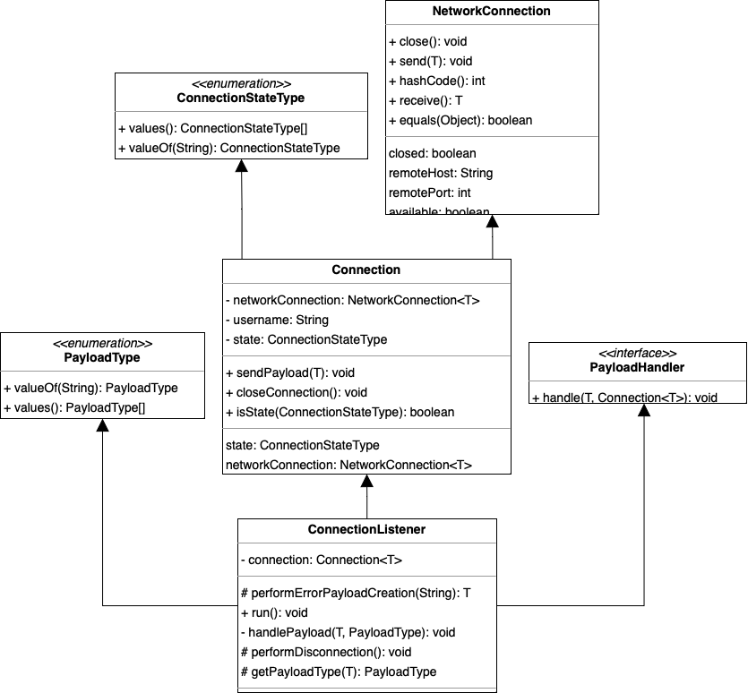
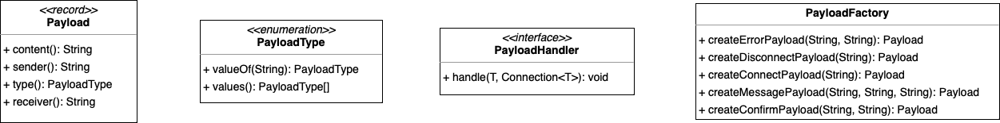
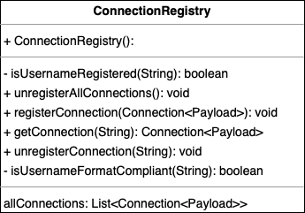

<a name="readme-top"></a>
<div align="center">


<h3 align="center">Multichat</h3>

  <p align="center">
    Chat more, type less! Let your fingers rest.
    <br />
    <br />
    <a href="#getting-started">Getting Started</a>
    ·
    <a href="#class-diagram">Class Diagram</a>
    ·
    <a href="#application-structure">Application Structure</a>
    ·
    <a href="#issue-list">Issue List</a>
    ·
    <a href="#github-workflow">GitHub Workflow</a>
  </p>
</div>

## Getting Started

### Cloning the repository

```
git clone https://github.com/boostvolt/zhaw-multichat.git
```

### Start the program

There are two ways of starting the program:

#### Starting with IntelliJ:

1. Make sure to have installed gradle version 8.0.1 or newer.
2. Open a command line prompt in the directory of the repository. Do this once for the server and as
   many times as you want to have clients. Use the following commands to start the server or client:

For the client

```bash
$ ./gradlew client:run
```

For the server

```bash
$ ./gradlew server:run
```

3. The program should compile and start accordingly.

### Stop the program

To stop the client just close the window.
To stop the client or the server close the window and press <kbd>CTRL + C</kbd> in the command line.

<p align="right">(<a href="#readme-top">back to top</a>)</p>

## Class Diagram

In the following class diagram we only included 1 PayloadHandler class on server and client side for
better readability.


<p align="right">(<a href="#readme-top">back to top</a>)</p>

## Application Structure

### Client

#### MVC Model



The classes `Client` and `ClientUI` were left untouched, since there was no refactoring needed.
However, a major structural flaw of the client was, that the MVC pattern was not implemented. The
existing classes were tightly coupled together in many places, violating the principle of separation
of concerns. For example, parts of the view, model, and controller were mixed together in the
`ChatWindowController` class. To implement the MVC pattern, the code was split into the
following classes:

##### Controller

The `ChatWindowController` class should contain all the controls. Since there is only one controller
in the application, ChatWindowController is the only class that falls under this scope. The
following features were implemented in it:

- JavaFX properties were used to allow the model classes to access the FXML fields saved in the
  ChatWindowController. These properties were bound in the ChatWindowController using the Observer
  pattern.
- All methods that didn't belong to any of the FXML controls were moved to either model or
  view classes, adhering to the Single Responsibility Principle.

#### Model

The Model should contain the logic that executes changes in the software. The following classes were
created therefore:

##### `ChatWindowModel`

This class contains the core logic of the client, responsible for sending and receiving messages as
well as connecting and disconnecting from the server. It also stores most of the bindings and lets
the other classes access them through public getter methods. With that, other classes stay updated
about changes without giving them too much access.

##### `MessageListModel`

This class originated from the ClientMessageList class. It extends
`javafx.collections.ObservableListBase<>`, which provides built-in support for the Observer pattern,
allowing other classes to track changes in the list without explicit listening to it. It contains
methods to modify the message list.

###### `FilteredMessageListModel`

This class is similar to the MessageListModel class. It handles the features needed to filter
messages. Unlike in the original class, the filter was separated into a different class.
With the help of an ObjectProperty, the filter is adjustable in various classes. As well as in the
ChatWindowModel, the property is available through a public getter method. This class mainly
contains methods to adjust the filter.

##### `MessageListView`

The View only contains code to display updated information on the screen. It was implemented in the
MessageListView class. The MessageListView class gets the updated information through a binding with
the FilteredMessageListModel. With that, the view was updated when the FilteredMessageList,
respectively the MessageListModel, was updated. The only purpose of this class is to display the
information.

#### Reasoning

The reason for this refactor is on one hand that the implementation of the MVC model is considered
best practice and also a requirement for this project. On the other hand, we could improve the code
by splitting it up into sections. It got easier to understand how single classes work, and we could
adhere to fundamental principles of software design, such as the principle of separation of
concerns, the Single Responsibility Principle, and the Observer pattern.

### Protocol

#### Connection



The protocol-level `Connection` class is a fundamental part of the application architecture. It
contains serializable connection information such as username, status and network connection, which
can be easily accessed with its getter and setter methods. In addition, the class contains the
sendPayload and closeConnection methods, which allow generic data packets to be sent over the
network, reacting appropriately to problems during transmission, and connections to be closed by
either the client or the server.

The `ConnectionStateType` enum at the protocol level ensures that both the client and the server use
the same set of connection states, avoiding potential confusion and errors that could arise from
using different connection states.

In addition, the abstract `ConnectionListener` class has been established at the protocol level to
handle incoming user data requests, handle method execution and error handling. The class is
implemented as runnable and is started as a thread on both the client and the server, keeping the
application stable and reliable.

#### Payload



The application has initially sent data via a string. This approach is not ideal for several
reasons. First, sending data as a string makes it difficult to standardise the format of the
exchanged data, which can lead to errors and data corruption. Second, sending data as a string can
be inefficient, especially when sending large amounts of data.

By introducing a payload record that contains the type, sender, receiver and message, the format of
the exchanged data is standardised and the possibility of errors or data corruption is reduced. The
use of a PayloadFactory to create payload data and a PayloadHandler to handle payload data also
creates a more efficient and scalable way to handle communication between client and server.

The `PayloadFactory` class provides a standardised way to create payloads for the various message
types, including Connect, Confirm, Disconnect and Message Types. By implementing
the `PayloadFactory`at the protocol level and using it on both the client and server side, it
ensures that payloads are created in a consistent and standardised manner throughout the
application.

Using an enum set to specify the available payload types simplifies implementation and reduces
redundancy in the code. It allows the different payload types to be specified in one place, making
it easier to maintain and update the application in the future.

The `PayloadHandler` interface provides a generic and extensible way to handle the different types
of payloads on the client and server side. By implementing the `PayloadHandler` for each payload
type, the payloads can be handled in a consistent manner, reducing errors and improving reliability.

### Server

#### Connection Registry



The `ConnectionRegistry` class on the server side manages all active connections. It performs
various functions such as checking the availability of a username, ensuring that it matches the
username format and generating an available anonymous username. By standardising the format of the
username and ensuring that it is unique, the application can avoid potential errors that could arise
from duplicate usernames or incorrect formats.

In addition to managing usernames, the ConnectionRegistry class also provides a mechanism for
registering and unregistering connections in the registry. This allows the application to keep track
of which clients are currently active and connected, which enables efficient processing of incoming
messages and ensures that the appropriate clients receive the relevant messages.

<p align="right">(<a href="#readme-top">back to top</a>)</p>

## Issue List

### Bugs

All bugs have been assigned with the label fix

1. Server connection of several clients not possible
2. Allocated anonymous usernames are not released on disconnect
3. Connected clients should disconnect on server shutdown
4. Server exception on non-port specified connection
5. Client connection thread not terminated on already taken username

### Structural Issues

All structural issues have been assigned with the label refactor

1. Refactor and unify `proccesData()` method
2. Implementation of MVC model
3. Introduce connection registry class
4. Extract client and server `ConnectoinHanlder` into abstract class
5. Ensure proper exception handling and logging

<p align="right">(<a href="#readme-top">back to top</a>)</p>

## GitHub Workflow

### Code of Conduct

Our [CODE OF CONDUCT](CODE_OF_CONDUCT.md) described the rules and guidelines for contributing to
our
project.

### Codeowners

We used the CODEOWNERS file to define the code owners for the repository.

### Issues / Pull Requests

Project management was done using GitHub Projects

We used the following templates for issues and pull requests:

- Issue labels
- [Issue template](.github%2FISSUE_TEMPLATE)
- [Pull request template](.github%2Fpull_request_template.md)

### Branching Model

We used the feature branching workflow for several reasons:

- Firstly, it promotes better organization and management of code changes, especially those
  involving multiple team members working on different features or tasks simultaneously. By creating
  separate branches for each feature or task, developers can work on their code changes
  independently without interfering with the work of others. This reduces the likelihood of
  conflicts arising between different changes, which can be time-consuming to resolve.

- Secondly, the feature branching workflow also enables better tracking of code changes and easier
  identification of issues or bugs. Since each feature branch contains changes related to a specific
  feature or task, it is easier to pinpoint issues and resolve them quickly.

- Finally, the feature branching workflow also facilitates better quality control and helps ensure
  that the project's overall codebase remains stable and functional. Changes are tested and reviewed
  before they are merged back into the main branch, reducing the risk of introducing bugs or errors
  into the production code.

<p align="right">(<a href="#readme-top">back to top</a>)</p>
